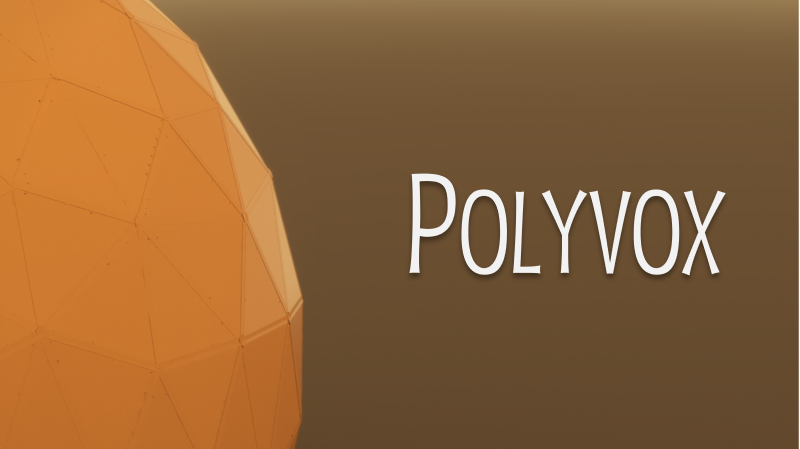

[//]: # (Version: 1.0.0)

<div align="center">

[**English**](./README.md) | [**中文**](./README.zh.md)

</div>

---

# Polyvox: Teardown 模型转换工具

[](https://opensource.org/licenses/MIT)
[](https://github.com/wudl-21/polyvox/releases/latest)

**Polyvox** 是一款强大且用户友好的桌面应用程序，旨在简化将标准 3D 模型（`.obj`）转换为 Teardown 游戏兼容格式的过程。它不仅能执行体素化，还提供了对物理材质和渲染属性的精细控制，并能自动生成在 Teardown 中使用的 `.xml` 预制件文件。

  

---

## ✨ 功能特性

*   **一键式转换**: 简单选择一个 `.obj` 文件和输出目录，即可开始转换。
*   **稳健的工作流**:
    *   所有操作均在临时目录中执行，以防止数据丢失。
    *   采用原子化文件提交机制，确保只有在成功完成时才修改您的输出目录。
    *   可以在任何阶段安全地中止流程，而不会损坏现有文件。
*   **高级材质映射**:
    *   **自动检测模式**: 智能地根据 `.mtl` 文件中的材质名称（如 "wood", "metal"）推断 Teardown 的物理材质。
    *   **手动模式**: 提供一个功能强大的图形界面，允许用户为每个材质手动指定 Teardown 物理标签（`$TD_wood`, `$TD_metal` 等）。
    *   **批量编辑**: 支持多选材质进行批量设置。
    *   **高级排序与筛选**: 提供多种排序模式（按名称、类型）和实时搜索功能，轻松管理大量材质。
*   **精细渲染控制**:
    *   允许为每种材质独立设置其在 `.vox` 文件中的渲染类型（漫反射、金属、玻璃、自发光）。
    *   可精确调整每种渲染类型的具体属性（如粗糙度、金属度、折射率、发光强度等）。
*   **预设系统**: 在“首选项”中为每种 Teardown 物理材质保存一套默认的渲染类型和属性，实现跨项目的一致性风格。
*   **现代化用户界面**:
    *   基于 PySide6 (Qt) 构建，界面美观、响应迅速。
    *   支持**浅色**和**深色**主题，并可跟随系统设置自动切换。
    *   **多语言支持**（中文/英文），并拥有易于扩展的本地化系统。
*   **非阻塞式响应**: 所有耗时操作均在后台线程中执行，主界面在转换过程中保持响应。
*   **实时反馈**: 通过进度条和详细的日志窗口实时显示转换进度和状态。

## 🚀 如何使用 (面向用户)

1.  **下载**: 前往本项目的 [Releases 页面](https://github.com/wudl-21/polyvox/releases/latest)，下载最新的 `polyvox-gui.exe` 可执行文件。
2.  **运行**: 双击 `polyvox-gui.exe` 启动程序。
3.  **选择模型**: 点击“浏览”按钮或直接将您的 `.obj` 文件**拖放**到主界面的输入框中。
    *   **重要**: 请确保 `.obj` 文件、其引用的 `.mtl` 文件以及所有纹理贴图都位于**同一个文件夹**内。
4.  **设置输出**: 选择一个用于存放生成的 `.vox` 和 `.xml` 文件的输出目录。
5.  **调整体素大小**: 根据需要设置“体素大小”参数，该值越小，模型越精细，但性能开销也越大。
6.  **(可选) 配置材质**:
    *   **自动模式**: 保持“自动检测物理材质”复选框勾选，程序将根据材质名称自动分配物理标签。
    *   **手动模式**: 取消勾选该复选框，然后点击“自定义材质...”按钮。在弹出的窗口中，您可以为每个材质指定物理标签和详细的渲染属性。
7.  **开始转换**: 点击“开始转换”按钮。
8.  **完成**: 等待进度条走完，程序会提示转换完成，并可选择直接打开输出文件夹。程序的输出包含两个目录：`vox`（包含所有`.vox`文件）和`prefab`（包含最终组装好的`.xml`文件）。请直接将这两个目录拷贝到您的Teardown模组根目录下。随后，在Teardown编辑器中新建一个`instance`，并选择刚才生成的`.xml`文件，即可将模型导入。您的模组目录结构应该类似如下：

```
你的模组/
├── prefab/
│   └── my_model.xml
├── vox/
│   └── my_model/
│       ├── surface_1.vox
│       ├── surface_2.vox
│       └── ...
└── main.xml (以及其他模组文件)
```

## 🛠️ 从源码构建 (面向开发者)

如果您想从源代码运行或修改本程序，请遵循以下步骤：

1.  **克隆仓库**:
    ```sh
    git clone https://github.com/wudl-21/polyvox.git
    cd polyvox
    ```

2.  **构建 C++ 后端**:
    *   本项目使用 CMake 进行构建。请确保您已安装 CMake 和一个支持 C++17 的编译器（如 Visual Studio, GCC, Clang）。
    *   打开终端，执行以下命令：
      ```sh
      cmake -S . -B build
      cmake --build build --config Release
      ```
    *   编译成功后，`polyvox.exe` 将会出现在 `bin/Release` 目录下。

3.  **安装 Python 依赖**:
    *   强烈建议使用虚拟环境。
    ```sh
    conda env create -f environment.yml
    conda activate polyvox
    ```

4.  **运行 GUI**:
    ```sh
    python script/main_gui.py
    ```

5.  **使用 PyInstaller 打包**:
    *   确保已安装 PyInstaller (`pip install pyinstaller`)。
    *   使用提供的 `.spec` 文件进行打包：
      ```sh
      pyinstaller polyvox-gui.spec --clean
      ```
    *   打包完成的可执行文件将位于 `dist` 目录下。

## ⚠️ 注意事项

*   **文件路径**: 为了获得最佳兼容性，请确保您的所有资源路径（`.obj`, `.mtl`, 纹理）中不包含复杂的非 ASCII 字符。
*   **模型位置**: 本工具会自动根据模型的包围盒来居中模型。您可能需要在 Teardown 编辑器中微调 `instance` 的位置。
*   **性能**: 非常复杂的模型（>10,000 面）或极小的体素尺寸可能会消耗大量内存和处理时间。建议使用面数合理的模型，并仅在必要时更改默认的体素大小。
*   **临时文件**: 程序默认使用系统的临时目录进行文件处理。您可以在 `首选项 -> 通用` 中指定一个自定义路径。

## 📜 许可证

本项目采用 [MIT 许可证](LICENSE)